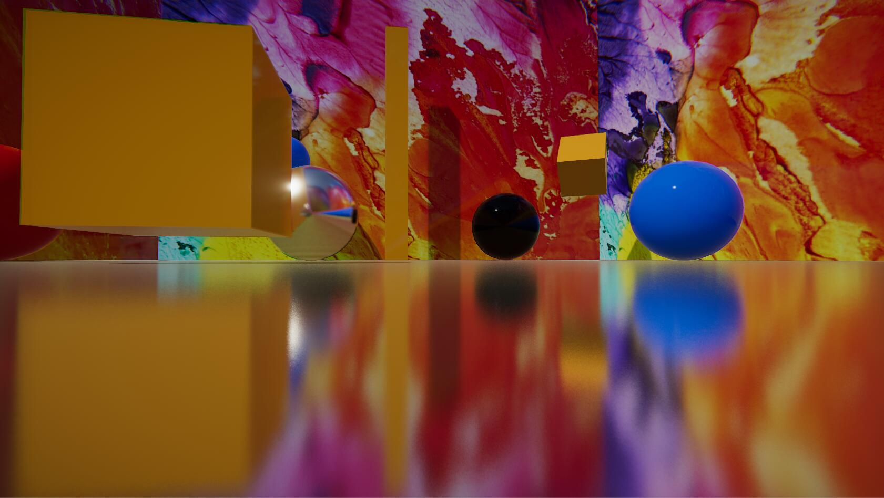
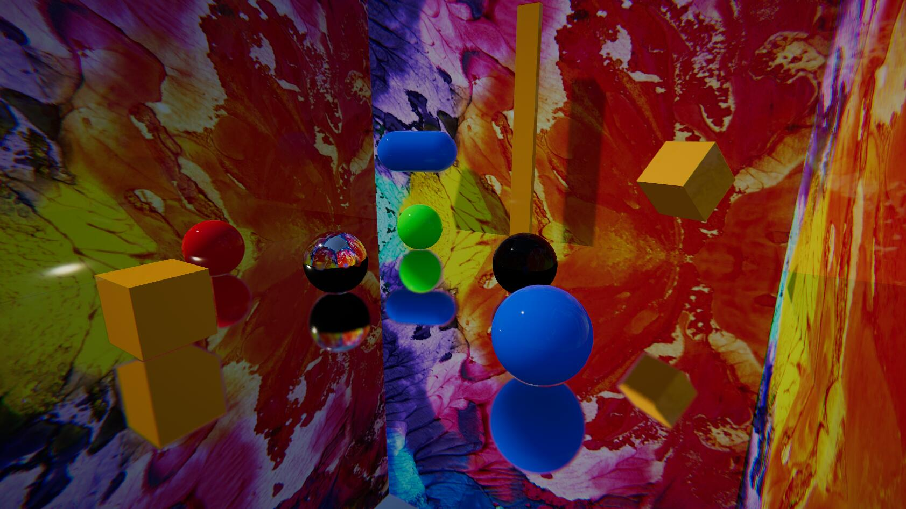
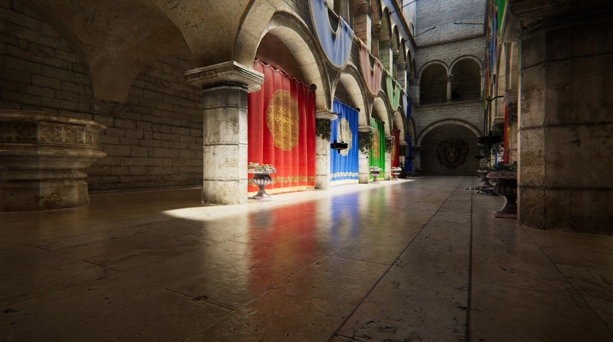
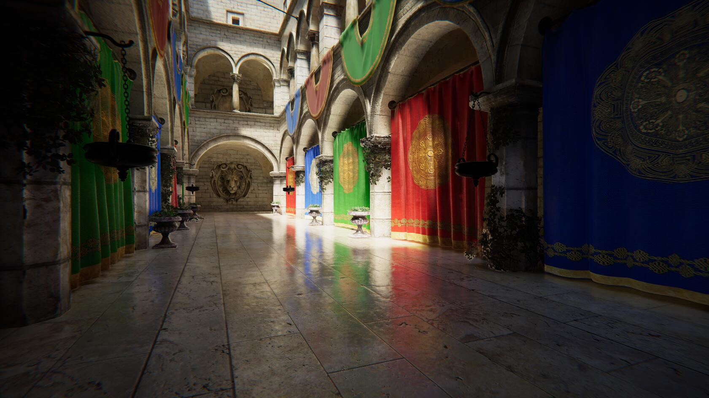

# Stochastic Screen Space Reflection
The main reference for this implementation is Xerxes1138 Stochastic SSR and FrostByte Stochastic SSR PPTX.
## How?
* 1. Add Stochastic Screen Space Reflection Component to you camera.
