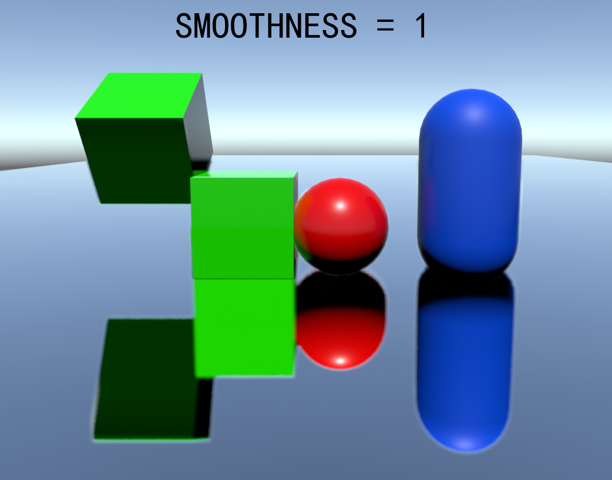
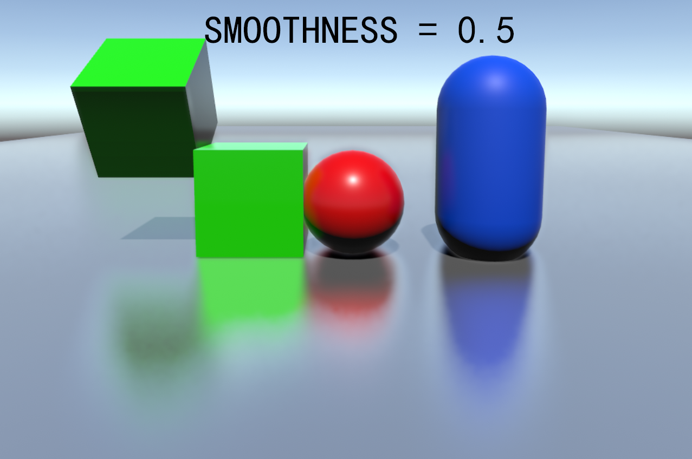
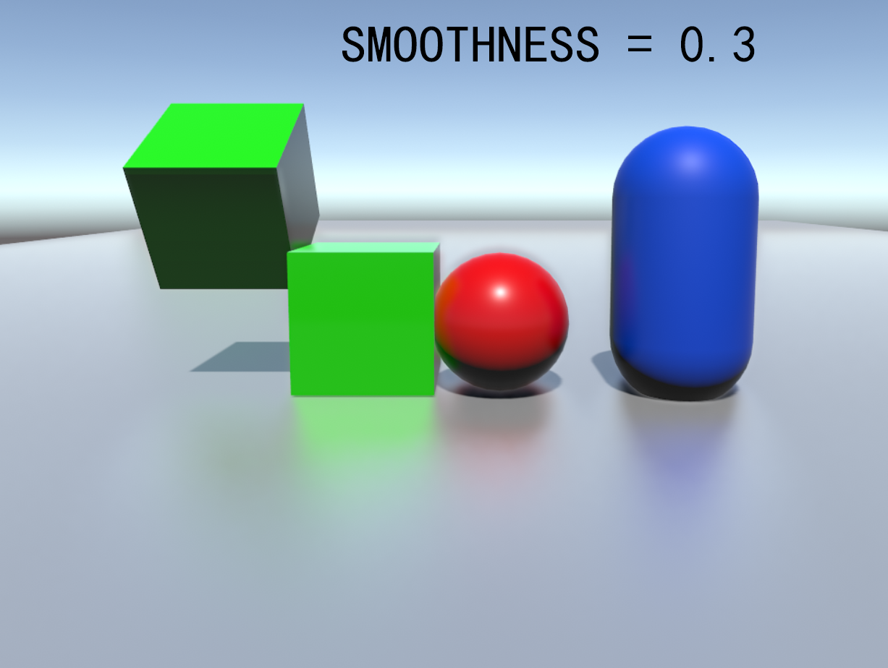

# Stochastic Screen Space Reflection
## Why?
* Although we do have Unity's official Postprocessing Stack V1 and V2, there are still many defects inside. Like the unperfact roughness present at V1 package and the fallback(to reflection probe) leak in V2. So, by implementing the Stochastic Screen Space Reflection algorithm published by FrostByte(SIGGRAPH 2015).
## How?
* 1. Open The sample scene in the package.
* 2. The only component we need is the "StochasticSSR.cs" under the main camera.
* 3. Transform the Built-in Deferred Reflection shader into the Custom Shader, just like the sample did!(Graphics/Deferred Reflection)
* 4. The explaination of each options has already been writen into the component, Enjoy it!